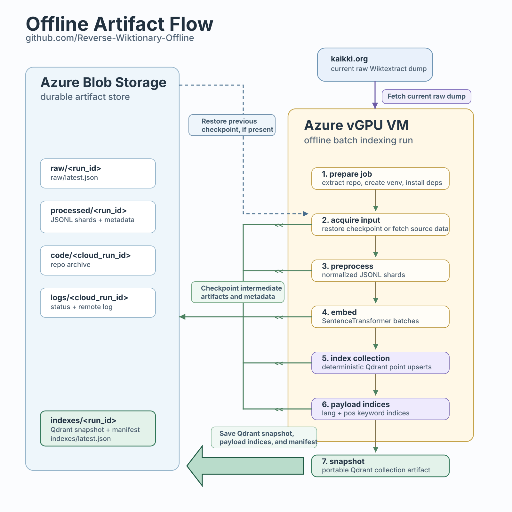

# Offline Indexing Design

The offline pipeline builds the production Qdrant collection from Wiktionary
source data and exports the collection as a Blob-backed snapshot.

The serving sister repository, `itincknell/Reverse-Wiktionary`, consumes the
snapshot artifacts produced here.

## Architecture

```text
raw Wiktionary JSONL
  -> preprocessing
  -> processed JSONL shards
  -> embedding generation
  -> Qdrant upsert/index
  -> Qdrant snapshot
  -> Azure Blob Storage
```

## Artifact Flow



## Artifact Layout

Blob prefixes:

```text
raw/<run_id>/
raw/latest.json

processed/<run_id>/
processed/<run_id>/serving_metadata.json
processed/latest.json

code/<cloud_run_id>/

logs/<cloud_run_id>/

indexes/<run_id>/
indexes/latest.json
```

Local generated data lives under `data/` and is not committed.

## Raw Input

Source:

```text
https://kaikki.org/dictionary/raw-wiktextract-data.jsonl.gz
```

The raw dump is downloaded once per source run and uploaded to Blob Storage.
Subsequent batch jobs read raw artifacts from Blob unless an explicit refresh
is required.

## Preprocessing

Producer:

```text
src/embeddings/parse_wiktionary.py
```

The parser emits one normalized row per raw record when the record contains
usable semantic glosses. The row unit is:

```text
language + word + part of speech + aggregated semantic glosses
```

Current processed row schema: `v6`

Required fields:

```text
lang
word
pos
glosses
embedding_text
```

Optional fields:

```text
expansion
ipa
audio_ogg_url
audio_mp3_url
```

`embedding_text` is the joined gloss text. It does not include the word,
language, or part of speech. Those fields are stored as metadata and used for
display/filtering.

Pronunciation display fields are selected greedily from the raw Wiktextract
`sounds[]` array. The parser keeps the first non-empty IPA string, OGG URL, and
MP3 URL encountered in list order. These fields are not embedded.

Wiktionary result links are derived by the serving layer from `word` and `lang`.
The offline artifact does not store full URLs or duplicate URL components that
can be computed from existing payload fields. The documented validation source
for language-section fragments is MediaWiki `action=parse&prop=tocdata`.

The parser filters low-value form/variant records, including `form_of`,
`alt_of`, alternative spellings, abbreviations, misspellings, obsolete senses,
and archaic senses. Topical categories are preserved as metadata candidates.

The preprocessing stage also writes:

```text
data/processed/<run_id>/serving_metadata.json
processed/<run_id>/serving_metadata.json
```

`serving_metadata.json` records language values and part-of-speech counts for
the processed run. It is used for audit, taxonomy generation, and downstream
artifact consumers.

## Embedding Generation

Producer:

```text
src/embeddings/generate_embeddings.py
```

Current embedding artifact schema: `v2`

The embedding generator:

```text
processed shards
  -> deterministic shard iteration
  -> SentenceTransformer batching
  -> per-shard vector artifacts
  -> bounded Qdrant upsert queue
  -> background Qdrant writer
  -> embedding manifest checkpoints
```

The production index uses:

```text
collection: reverse_wiktionary_v2
model: sentence-transformers/distiluse-base-multilingual-cased-v2
vector_size: 512
batch_size: 128
queue_size: 4
distance: cosine
point_id_shard_size: 50,000
vectors_on_disk: true
on_disk_payload: true
scalar_quantization: int8, quantile 0.99, always_ram true
```

The generator writes per-shard vector artifacts before Qdrant upsert. This makes
Qdrant upsert and snapshot recovery independent of GPU embedding once a shard
has been encoded.

Qdrant upsert requests use a fixed 3600-second client timeout. This is an
internal guardrail for large on-disk collection writes, not a run parameter.

## Qdrant Collection

One Qdrant collection stores all normalized rows.

Vector configuration:

```text
dimension: 512
distance: cosine
```

Payload fields:

```text
lang
word
pos
glosses
expansion
ipa
audio_ogg_url
audio_mp3_url
```

Downstream query systems commonly filter on `lang` and `pos`. The offline
snapshot includes payload indexes:

```text
lang: keyword
pos: keyword
```

These indexes are part of the Qdrant artifact build, not application
deployment. Creating them before snapshotting lets any consumer restore a
collection that is already ready for filtered vector search.

## Operational Constraints

- GPU VMs are batch compute only.
- Blob Storage is the durable artifact layer.
- Snapshot/upload recovery is separate from embedding generation.
- Local and VM Qdrant storage lives under ignored `data/` paths.
- Run records hold dated operational incidents and recovery notes.
